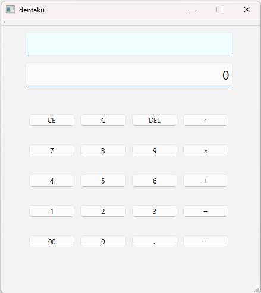

# Calculator

Qt6 / C++ を用いて作成したシンプルな電卓アプリです。

C++および Qt の学習を目的として作成した電卓アプリの改善版であり、表示処理や状態管理を見直し、責務をより明確に分離するリファクタリングを実施しました。

---

## 動作環境

- Windows 10 / 11
- Qt 6
- Visual Studio 2022
- C++17

---

## 主な機能

- 四則演算
- 小数入力
- CE
- C
- DEL
- 桁区切り表示
- 0 除算時のエラー表示

---

## 使用技術

- C++
- Qt6 Widgets
- Visual Studio 2022
- Git / GitHub

---

## プロジェクト構成

```
src
├── application
│   ├── CalculatorState.cpp
│   └── CalculatorState.h
├── domain
│   ├── Calculator.cpp
│   ├── Calculator.h
│   └── Operator.h
├── presentation
│   ├── DisplayFormatter.cpp
│   └── DisplayFormatter.h
├── ui
│   ├── MainWindow.cpp
│   ├── MainWindow.h
│   └── MainWindow.ui
└── Main.cpp
```

---

## このバージョンで改善した点

- 表示処理を `DisplayFormatter` クラスへ分離
- 演算子定義を `Operator` として独立
- 入力・状態遷移・計算処理を `CalculatorState` に集約
- `MainWindow` は UI イベント処理と画面更新に専念
- `application`・`domain`・`presentation`・`ui` のフォルダ構成を採用
- 各クラス・各フォルダの責務を明確化し、保守性・可読性を向上

---

## 今後の改善予定

- キーボード入力への対応
- 単体テストの追加
- CMake への対応
- MVC / MVVM など、より保守性を意識した設計への改善

---

## スクリーンショット


